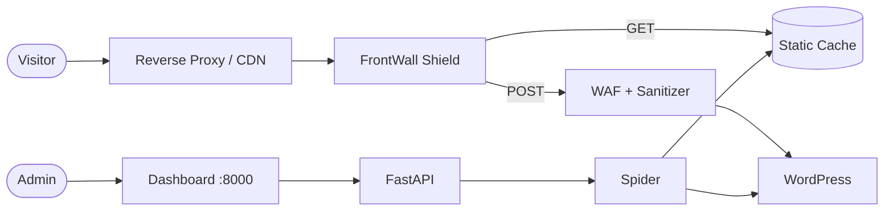

<p align="center">
  
  
  
  
  
  
</p>

# FrontWall

**FrontWall** is an open-source security reverse proxy for WordPress. It sits in front of your WordPress site, crawls and caches the entire site as static files, and serves them through a hardened layer with a WAF, input sanitization, rate limiting, and more.

Your WordPress becomes invisible to the internet. Visitors get fast static pages. Attackers get nothing.

## Why FrontWall?

WordPress powers over 40% of the web — and is the most targeted CMS. Plugins, themes, and PHP itself create an enormous attack surface. FrontWall eliminates that surface entirely:

| Without FrontWall | With FrontWall |
|---|---|
| PHP executes on every request | Zero PHP execution — pure static files |
| Database exposed to SQL injection | No database access from the frontend |
| wp-admin reachable by anyone | wp-admin completely hidden |
| Plugins introduce vulnerabilities | Plugin code never runs for visitors |
| Brute-force login attempts | No login page to attack |

## Architecture

```
Internet → Nginx/Cloudflare (TLS) → FrontWall Shield → Static Cache
                                          ↓ (POST only, sanitized)
                                        WordPress (hidden)
```



- **Dashboard** (port `8000`) — Admin-only. Manage sites, run crawls, configure rules, monitor security.
- **Shield** (configurable port per site) — Public-facing. Serves cached static content and forwards sanitized POST requests.

## Features

### Security
- **Static caching** — Entire WordPress site served as flat files. No PHP, no database.
- **Web Application Firewall (WAF)** — Blocks SQL injection, XSS, path traversal, bot scanners, and WordPress-specific attack paths.
- **POST sanitization** — Multi-layer validation: field whitelisting, HTML stripping, type checking, injection detection, length limits, and custom regex.
- **Rate limiting** — Per-IP token bucket. Static assets bypass limits automatically.
- **GeoIP country blocking** — Block high-risk countries via Cloudflare headers or MaxMind GeoIP database.
- **Dynamic Content Security Policy** — CSP auto-generated from your site's actual resources.
- **Security headers** — HSTS, X-Frame-Options, X-Content-Type-Options, Referrer-Policy, and Permissions-Policy on every response.
- **Honeypot fields** — Catch bots filling hidden form fields.
- **LFI/RFI detection** — Blocks local/remote file inclusion patterns, double encoding, and null-byte injection.

### Intelligence
- **Learn mode** — Automatically discovers POST rules, CSP origins, and missing assets from live traffic.
- **Security analytics** — Real-time dashboard with threat timeline, attacker tracking, event breakdown, severity charts, and log export (CSV/JSON).
- **Form detection** — Crawler detects HTML forms and suggests POST exception rules.

### Management
- **Multi-site support** — Protect multiple WordPress sites from a single instance, each with its own port and security config.
- **Multi-user** — Role-based access (admin/viewer), email invitations, password reset, account lockout.
- **Passkey / WebAuthn** — Passwordless authentication with FIDO2 hardware keys and biometrics.
- **Multilanguage UI** — English and Spanish. Language switcher with localStorage persistence.
- **Mobile-first dashboard** — Fully responsive admin interface.

## Quick start

### Prerequisites

- [Docker](https://docs.docker.com/get-docker/) and [Docker Compose](https://docs.docker.com/compose/install/)

### 1. Clone and configure

```bash
git clone https://github.com/acalatrava/FrontWall.git
cd FrontWall
cp .env.example .env
```

Edit `.env` and set a strong secret key:

```bash
# Generate a random key
openssl rand -hex 32
```

Paste the generated key as the value of `WS_SECRET_KEY` in `.env`.

### 2. Start the service

```bash
docker compose up -d
```

### 3. Create your admin account

Open **http://localhost:8000** in your browser. The first visit prompts you to create an admin account.

### 4. Add and protect a site

1. Go to **Sites → Add Site** and enter your WordPress URL.
2. Go to the site's **Crawler** page and click **Start Crawl**.
3. Review **Cached Pages** and add any missing URLs manually.
4. Configure **POST Rules** for contact forms (or enable **Learn Mode** to capture them automatically).
5. Go to **Shield → Deploy** to start serving the protected site.

### 5. Point your reverse proxy

Configure your reverse proxy (Nginx Proxy Manager, Caddy, Traefik, etc.) to forward traffic to the shield port:

```nginx
# Example Nginx configuration
location / {
    proxy_pass http://frontwall:8080;
    proxy_set_header Host $host;
    proxy_set_header X-Real-IP $remote_addr;
    proxy_set_header X-Forwarded-For $proxy_add_x_forwarded_for;
    proxy_set_header X-Forwarded-Proto $scheme;
}
```

> **Important:** Keep port `8000` internal. Do not expose the admin dashboard to the public internet.

## Development setup

### Backend

```bash
cd backend
python -m venv .venv
source .venv/bin/activate
pip install -r requirements.txt
uvicorn main:app --reload --port 8000
```

### Frontend

```bash
cd frontend
npm install
npm run dev
```

The frontend dev server runs on port `3000` and proxies `/api` requests to port `8000`.

### Landing page (web/)

The public landing page is a standalone Vue project in the `web/` directory:

```bash
cd web
npm install
npm run dev
```

It deploys automatically to GitHub Pages on push to `main` (see `.github/workflows/deploy-web.yml`).

## Configuration

### Environment variables

| Variable | Default | Description |
|---|---|---|
| `WS_SECRET_KEY` | `change-me-in-production` | **Required.** JWT signing key. Use a strong random value. |
| `WS_ADMIN_PORT` | `8000` | Admin dashboard and API port. |
| `WS_LOG_LEVEL` | `info` | Logging level (`debug`, `info`, `warning`, `error`). |
| `WS_COOKIE_SECURE` | `false` | Set to `true` when behind HTTPS in production. |
| `WS_DATA_DIR` | `./data` | Directory for SQLite database and static cache. |

### SMTP (optional)

Required for email invitations and password resets.

| Variable | Description |
|---|---|
| `WS_SMTP_HOST` | SMTP server hostname |
| `WS_SMTP_PORT` | SMTP port (typically `587` for STARTTLS) |
| `WS_SMTP_USER` | SMTP username |
| `WS_SMTP_PASSWORD` | SMTP password |
| `WS_SMTP_FROM_EMAIL` | Sender email address |
| `WS_SMTP_FROM_NAME` | Sender display name |

### WebAuthn / Passkeys (optional)

Required for passwordless authentication with hardware keys or biometrics.

| Variable | Description |
|---|---|
| `WS_WEBAUTHN_RP_ID` | Relying Party ID — your domain (e.g., `example.com`) |
| `WS_WEBAUTHN_RP_NAME` | Display name shown during registration (e.g., `FrontWall`) |
| `WS_WEBAUTHN_ORIGIN` | Expected origin URL (e.g., `https://example.com`) |

### Per-site settings

Each site has its own configuration in the dashboard, including:

- **Shield port** — Unique port per site (range 8080–8099)
- **WAF toggle** — Enable/disable the web application firewall
- **Rate limiting** — Requests per window, window duration
- **Security headers** — Toggle HSTS, CSP, X-Frame-Options, etc.
- **Bot blocking** — Block known malicious scanners
- **Suspicious path blocking** — Block wp-admin, .env, .git, etc.
- **IP whitelist / blacklist** — Allow or block specific IPs
- **Country blocking** — Block traffic from specific countries
- **Max body size** — Limit POST request body size
- **Internal URL** — Direct address for WordPress behind a private network
- **Override Host** — Custom Host header for internal connections

## Security model

FrontWall applies defense in depth with 7+ layers:

1. **Static serving** eliminates PHP execution and database queries from the public-facing surface.
2. **WAF** blocks known attack tools (SQLMap, Nikto, etc.), path traversal, and WordPress-specific attack paths.
3. **POST data is sanitized** through field whitelisting, type validation, HTML stripping, SQL/XSS injection detection, and length enforcement.
4. **Security headers** (CSP, HSTS, X-Frame-Options, etc.) are injected into every response.
5. **Rate limiting** prevents brute force, DDoS, and resource exhaustion.
6. **GeoIP blocking** filters traffic from high-risk countries.
7. **LFI/RFI scanner** detects file inclusion patterns, double encoding, and null-byte injection in POST data.

Additional security measures:

- **JWT authentication** with short-lived access tokens (15 min) + refresh token rotation with family-based theft detection.
- **HttpOnly + Secure + SameSite=Strict cookies** — tokens never touch JavaScript.
- **Brute-force protection** on login with progressive delays.
- **Account lockout** after repeated failed attempts.
- **SSRF prevention** — blocks requests to private IP ranges and cloud metadata endpoints.
- **Input validation** — strict checks on usernames, passwords, hostnames (CRLF prevention), and email addresses.
- **ReDoS prevention** — bounded regex execution for user-defined patterns.
- **CORS hardening** — restricted to specific origins.

## Tech stack

| Component | Technology |
|---|---|
| Backend | Python 3.12, FastAPI, Uvicorn |
| Database | SQLite, SQLAlchemy (async), Alembic |
| Crawler | httpx (HTTP/2), BeautifulSoup4, cssutils |
| Frontend | Vue 3, Vite, TailwindCSS v4, Pinia |
| Auth | bcrypt, python-jose (JWT), WebAuthn |
| Sanitization | bleach, custom WAF rules |
| GeoIP | Cloudflare `CF-IPCountry` header, MaxMind GeoLite2 (optional) |
| Deployment | Docker, Docker Compose |

## Project structure

```
FrontWall/
├── backend/                  # Python FastAPI backend
│   ├── api/                  # API route handlers
│   ├── crawler/              # Spider engine, URL rewriter, asset processor
│   ├── models/               # SQLAlchemy models
│   ├── services/             # Business logic (shield, security, auth)
│   ├── shield/               # WAF, rate limiter, CSP builder, security headers
│   ├── main.py               # FastAPI application entry point
│   └── requirements.txt
├── frontend/                 # Vue 3 admin dashboard
│   ├── src/
│   │   ├── views/            # Page components
│   │   ├── components/       # Shared components (Sidebar)
│   │   ├── stores/           # Pinia state management
│   │   ├── i18n/             # Translations (en.json, es.json)
│   │   └── api.js            # Axios HTTP client
│   └── package.json
├── web/                      # Public landing page (standalone Vue project)
│   ├── src/
│   │   ├── views/            # Landing page
│   │   └── i18n/             # Translations (en.json, es.json)
│   ├── Dockerfile
│   └── docker-compose.yml
├── .github/workflows/        # CI/CD (GitHub Pages deployment)
├── docker-compose.yml        # Production deployment
├── Dockerfile                # Multi-stage build
└── .env.example              # Environment variable template
```

## Contributing

Contributions are welcome. Please:

1. Fork the repository.
2. Create a feature branch (`git checkout -b feature/my-feature`).
3. Commit your changes with clear commit messages.
4. Open a pull request describing what you changed and why.

For bugs, please open an [issue](https://github.com/acalatrava/FrontWall/issues) with steps to reproduce.

## License

This project is open source and available under the [MIT License](LICENSE).
